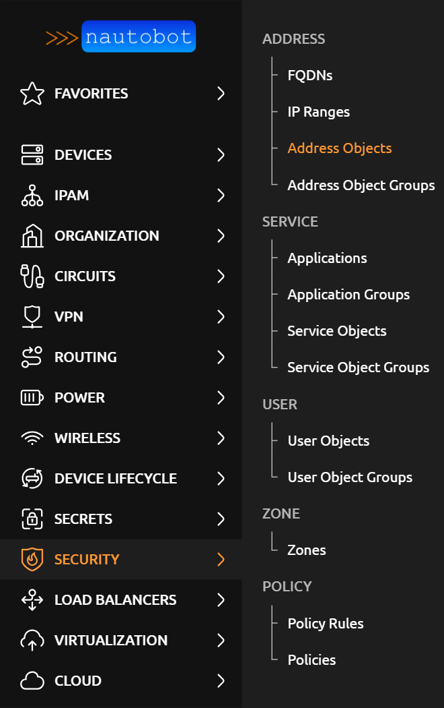
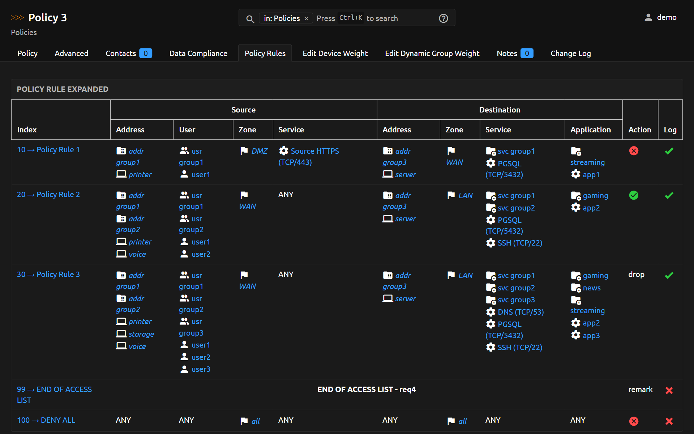

# Nautobot Firewall Models

  
   
  An <a href="https://networktocode.com/nautobot-apps/">App</a> for <a href="https://nautobot.com/">Nautobot</a>.

## Origin and Attribution

This repository is maintained by INVITE Networks and is derived from [Nautobot Firewall Models](https://github.com/nautobot/nautobot-app-firewall-models) v3.0.1 by Network to Code, LLC. The original work is licensed under the Apache License 2.0, and this repository is distributed under the same license. See [LICENSE](LICENSE) and [NOTICE](NOTICE) for details.

This is an independent copy, not a fork that tracks upstream. Please report issues with this version to this repository rather than to the upstream project.

## Overview

A plugin for [Nautobot](https://github.com/nautobot/nautobot) that is meant to model layer 4 firewall policies and/or extended access control lists.

### Screenshots

More screenshots can be found in the [Using the App](https://docs.nautobot.com/projects/firewall-models/en/latest/user/app_use_cases/) page in the documentation. Here's a quick overview of some of the app's added functionality:

## Try it out!

This App is installed in the Nautobot Community Sandbox found over at [demo.nautobot.com](https://demo.nautobot.com/)!

> For a full list of all the available always-on sandbox environments, head over to the main page on [networktocode.com](https://www.networktocode.com/nautobot/sandbox-environments/).

## Documentation

Full documentation for this App can be found over on the [Nautobot Docs](https://docs.nautobot.com) website:

- [User Guide](https://docs.nautobot.com/projects/firewall-models/en/latest/user/app_overview/) - Overview, Using the App, Getting Started.
- [Administrator Guide](https://docs.nautobot.com/projects/firewall-models/en/latest/admin/install/) - How to Install, Configure, Upgrade, or Uninstall the App.
- [Developer Guide](https://docs.nautobot.com/projects/firewall-models/en/latest/dev/contributing/) - Extending the App, Code Reference, Contribution Guide.
- [Release Notes / Changelog](https://docs.nautobot.com/projects/firewall-models/en/latest/admin/release_notes/).
- [Frequently Asked Questions](https://docs.nautobot.com/projects/firewall-models/en/latest/user/faq/).

### Contributing to the Documentation

You can find all the Markdown source for the App documentation under the [`docs`](docs) folder in this repository. For simple edits, a Markdown capable editor is sufficient: clone the repository and edit away.

If you need to view the fully-generated documentation site, you can build it with [MkDocs](https://www.mkdocs.org/). A container hosting the documentation can be started using the `invoke` commands (details in the [Development Environment Guide](https://docs.nautobot.com/projects/firewall-models/en/latest/dev/dev_environment/#docker-development-environment)) on [http://localhost:8001](http://localhost:8001). Using this container, as your changes to the documentation are saved, they will be automatically rebuilt and any pages currently being viewed will be reloaded in your browser.

Any PRs with fixes or improvements are very welcome!

## Questions

For questions or problems with this version, open an issue in [this repository](https://github.com/invite-networks/nautobot-firewall-models/issues). The upstream [FAQ](https://docs.nautobot.com/projects/firewall-models/en/latest/user/faq/) is also a useful reference.
